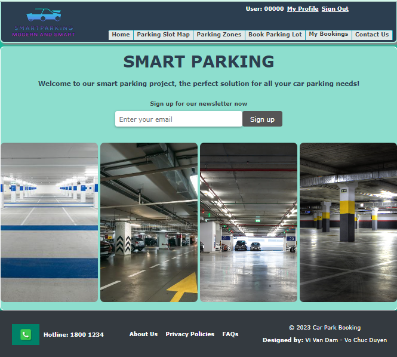
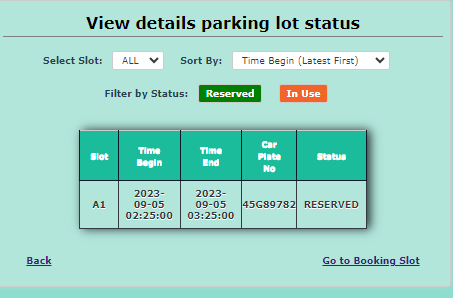
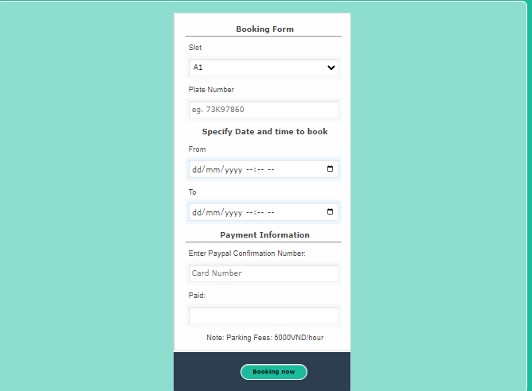

#SMART PARKING RESERVATION SYSTEM
---
This project is a Smart Parking Reservation System that aims to provide efficient parking management and reservation services. 
It utilizes various technologies and functionalities to improve the parking experience for users.
---
#TECHNOLOGIES USED
* Frontend: HTML, CSS, JavaScript
* Backend: PHP, MySQL for data storage and processing
* IoT Devices: Sensors, Actuators
* Machine Learning: Python

#GETTING STARTED
To set up and run the Smart Parking Reservation System, follow the instructions below:
* Step 1: Download source code.
* Step 2: Extract file.
* Step 3: Copy project folder. Third, copy the project folder and paste it into the xampp/htdocs folder parking management system project folder
* Step 4: Open xampp. Fourth, open xampp and start the apache and MySQL. 
* Step 5: Open browser. Fifth, Open a browser and go to URL “http://localhost/phpmyadmin/” parking management system open phpmyadmin
* Step 6: Create database. Sixth, click on databases tab and Create database naming “parking”. parking management system create database
* Step 7: Import “parking.sql”. Seventh, Click on browse file and select “parking.sql” file which is inside “database” folder and after import 
  click “go“. 
* Step 8: Open browser and type folder name. Eight, Open a browser and go to URL “http://localhost/parking/”.
* Step 9: Explore manipulating. Final step , Login from the User’s login side. Just provide the Admin’s login detail, it will redirect you to 
  Admin panel.
  
#WEBSITE PREVIEW
Admin:
* Manage Bookings: Admins control parking reservations. 
* Manage Users: Admins oversee user accounts. 
* Statistics: Admins access usage data. 
* Message Users: Admins communicate with users. 

User:
* Homepage: Users explore parking options. 
* Detail Booking: Users check reservation details. 
* Booking Form: Users make parking reservations. 
* Parking Zones: Users choose parking areas. 

#CONTRIBUTION
* Contributions to the Smart Parking Reservation System are welcome. If you find any issues or have suggestions for improvement, please feel free to submit a pull request.

#LICENSE
* This project is licensed under the MIT License. Feel free to use and modify the code as per the license terms.

